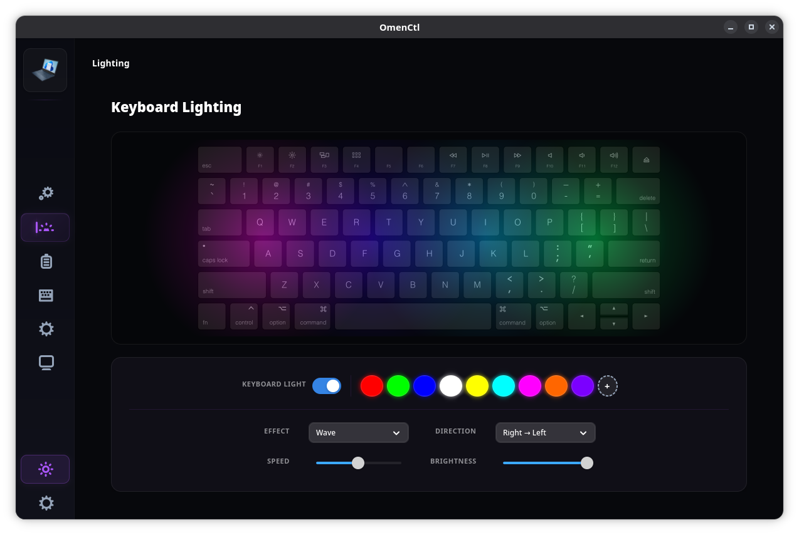
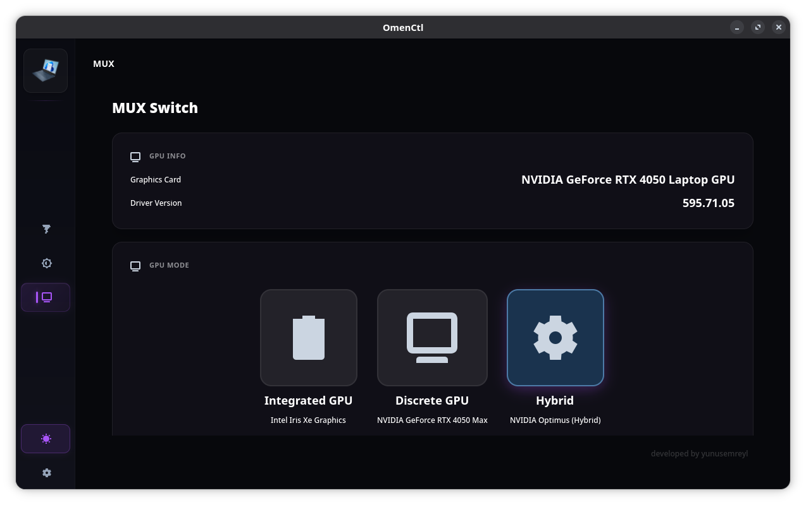
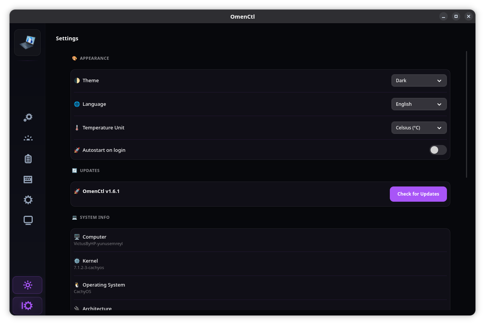
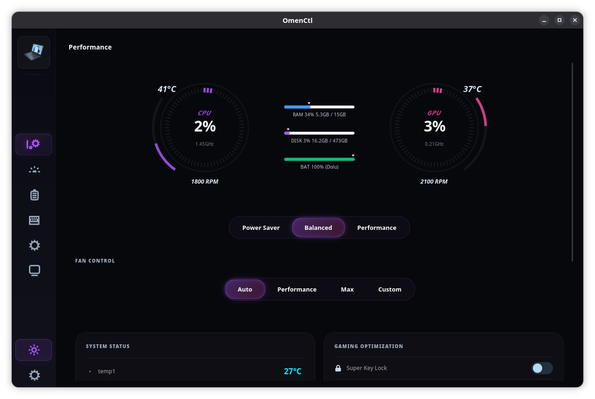

 # OMEN Command Center for Linux v1.3.5 #
<p align="center">
  

## 📖 About The Project
<p align="center">
  
  
</p>
<p align="center">
  
  
</p>
<p align="center">
  
  
</p>

**OMEN Command Center for Linux** is a native Linux application designed to unlock the full potential of HP Omen and Victus series laptops. It serves as an open-source alternative to the official OMEN Gaming Hub, providing essential controls in a modern, user-friendly interface.

**New in v1.3.5:**

### 🛠️ What's New?
### 🧩 Decoupled Microservices Architecture
Instead of one large background process, the system now runs 5 independent services, each dedicated to a specific task:

hpm-fan: Intelligent fan control and curve management.
hpm-rgb: Lighting effects and animation engine.
hpm-power: Power profiles and energy management.
hpm-mux: GPU switching logic (prime-select, envycontrol, etc.).
hpm-platform: System temperatures, battery info, and keyboard fixes.
This architecture ensures that if one service (e.g., RGB) fails, critical system functions like fan control or MUX switching continue to work uninterrupted.

### ⚡ Maximum Performance & Minimum Resource Usage
RGB Engine: When using a static color, the engine now enters a deep sleep using Event.wait(), consuming 0% CPU.
Smart GPU Monitoring: The service now checks the Nvidia GPU's power state (suspended) before polling. It will not force-wake the dGPU, significantly extending battery life.
Dynamic Backoff: Polling intervals automatically expand when system values remain unchanged, further reducing background overhead.
### 🎮 GPU TGP 80W Cap Mitigation (HP Omen Max 16)
The chronic issue in mainline kernels (v7.0+) that caused the GPU power to be capped at 80W on certain Omen models (specifically 8D41) has been fixed. Thanks to a patch provided by xcellsior, the unnecessary firmware writes at probe time are now gated, allowing your GPU to reach its full TGP!

### 🔄 Refined Installation & Update Experience
Due to the major architectural change, you must use the updater script: sudo ./setup.sh update to transition to this version.
The installer now prompts you before installing the "Custom DKMS Driver." (Kernel 7.0+ users with working out-of-the-box fan control can safely skip this).
### ⚠️ Important Update Instructions
If you are upgrading from an older version, please run the following commands in your terminal to cleanly remove old service artifacts and register the new microservices:

```bash
cd OmenCommandCenterforLinux
git pull
sudo ./setup.sh update
```


## ✨ Features

### 🎨 RGB Lighting Control
- **4-Zone Control**: Customize colors for different keyboard zones.
- **Effects**: Static, Breathing, Wave, Cycle.
- **Brightness & Speed**: Adjustable parameters for dynamic effects.
- **Low-CPU Wave Engine**: On tested systems, wave mode CPU usage dropped from ~22-28% average to ~2% average in stress conditions.

### 📊 System Dashboard
- **Real-time Monitoring**: CPU/GPU temperatures and Fan speeds.
- **Performance Profiles**: One-click power profile switching (requires `power-profiles-daemon`).

### 🌪️ Fan Control
- **Standard Mode**: Intelligent software-controlled fan curve for balanced noise/performance.
- **Max Mode**: Forces fans to maximum speed for intensive tasks.
- **Custom Mode**: Drag-and-drop curve editor to create your own fan profiles.

### 🎮 GPU MUX Switch (BETA)
- Switch between **Hybrid**, **Discrete**, and **Integrated** modes.
- Backend can be selected from **Settings → GPU / MUX**.
- Auto mode now prefers `envycontrol` / `supergfxctl` / `prime-select` before HP WMI direct.
- ⚠️ Some hardware/BIOS combinations may still require reboot or vendor-specific tooling behavior.

### ⌨️ Desktop Shortcuts (Recommended)
 To minimize background resource usage, we have removed the active OMEN Key listener daemon. We highly recommend creating a **Custom Shortcut** in your Desktop Environment settings (GNOME, KDE, etc.):
 - **Command**: `hp-manager`
 - **Shortcut Key**: Your **OMEN Key** (detected as `KEY_PROG2`) or any preferred key combinations.
 This provides a much more responsive experience compared to a background listener thread.

## 🚀 Installation

### Prerequisites
- A Linux distribution (Ubuntu, Fedora, Arch, OpenSUSE, etc.)
- `git` installed

### Install
Open a terminal and run:

```bash
# Clone the repository
git clone https://github.com/yunusemreyl/OmenCommandCenterforLinux.git
cd OmenCommandCenterforLinux

# Run the installer (requires root)
chmod +x setup.sh
sudo ./setup.sh install
```
Note: For compatibility with older documentation, `sudo ./install.sh` redirects to `setup.sh install`.
Installation Warning ⚠️: We recommend restarting your computer after installation.

### Updating

**⚠️ IMPORTANT for v1.3.5 Updates:** Because the architecture changed from a single monolithic daemon to a microservices architecture, you **must** use the updater script to cleanly remove the old services and install the new ones.

1. `cd OmenCommandCenterforLinux`
2. `sudo ./setup.sh update`

### Script Layout

Maintenance scripts are now organized under:

- `scripts/fixes/`
- `scripts/diagnostics/`
- `scripts/tests/`

Legacy entry points (`fix_hp_wmi.sh`, `fix_omen.sh`, `dump_log.sh`, `test_nvidia.py`) are kept at the repository root as compatibility wrappers.

For OMEN Max 16 / hp-wmi probe troubleshooting, use:
- `scripts/tests/test_hp_wmi_raw_payload.sh`

The installer will automatically:
1. Detect your package manager and install dependencies.
2. Detect your kernel version and install the appropriate driver:
   - **Kernel ≥ 7.0**: Only installs `hp-rgb-lighting` (RGB). Fan control is provided by the stock `hp-wmi` module.
     - **Exception**: OMEN Max 16 board `8D41` is forced to the custom `hp-wmi` path due stock probe incompatibility.
   - **Kernel < 7.0**: Installs both the custom `hp-wmi` driver (backported) and `hp-rgb-lighting`.
3. Install the daemon and GUI components.
4. Set up system services.
5. Provide a troubleshooting guide if issues occur.

## 🗑️ Uninstallation

To completely remove the application and its services:

```bash
cd OmenCommandCenterforLinux
sudo ./setup.sh uninstall
```

## 🐧 Compatibility

| Distribution | Status | Notes |
|--------------|--------|-------|
| **Ubuntu 24.04 LTS / Zorin OS / Pop!_OS / Linux Mint** | ✅ Verified | Full support via `apt` |
| **Fedora 42+ / Nobara** | ✅ Verified | Full support via `dnf` |
| **Arch Linux / CachyOS / Manjaro** | ✅ Verified | Full support via `pacman` |
| **OpenSUSE Tumbleweed** | ✅ Verified | Full support via `zypper` |


## 👨‍💻 Credits & Acknowledgments
- **Lead Developer**: [yunusemreyl](https://github.com/yunusemreyl)
- **Contributors**: [ja4e](https://github.com/ja4e), [babyinlinux](https://github.com/babyinlinux), [entharia](https://github.com/entharia) 
- **Kernel Module Development**: Special thanks to **[TUXOV](https://github.com/TUXOV/hp-wmi-fan-and-backlight-control)** for the `hp-wmi-fan-and-backlight-control` driver, which makes fan control possible. Also thanks to **xcellsior** for the Nvidia Dynamic Boost 80W cap mitigation patch.

## ⚖️ Legal Disclaimer
This tool is an independent open-source project developed by **yunusemreyl**.
It is **NOT** affiliated with or endorsed by **Hewlett-Packard (HP)**.
The software is provided “as is”, without warranty of any kind.

---
*Developed with ❤️ by yunusemreyl*
