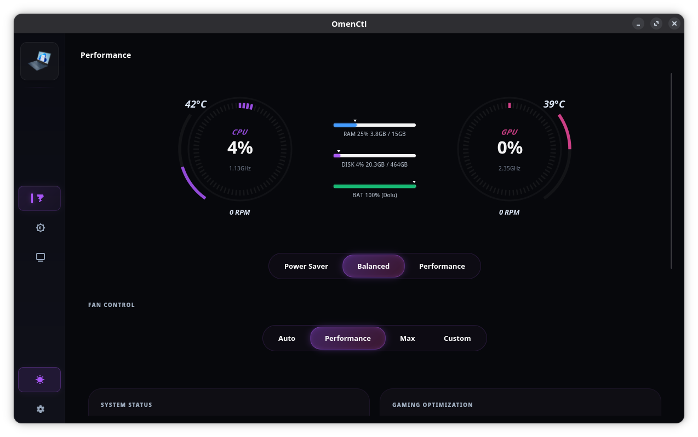
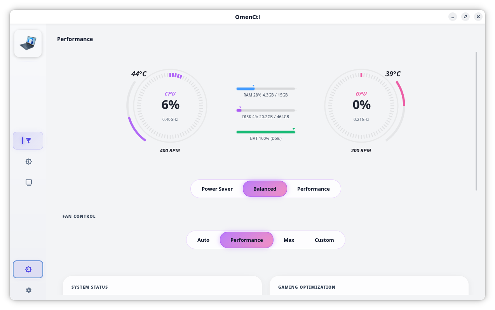
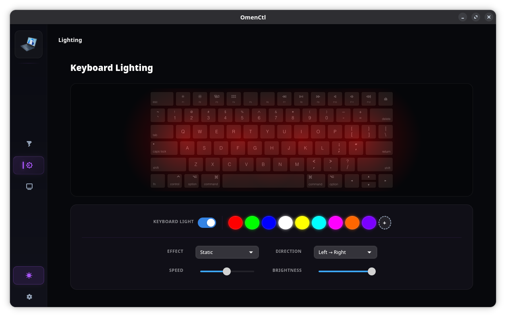
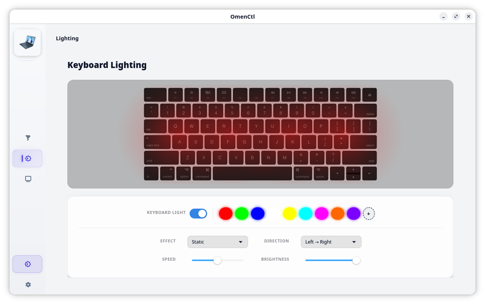
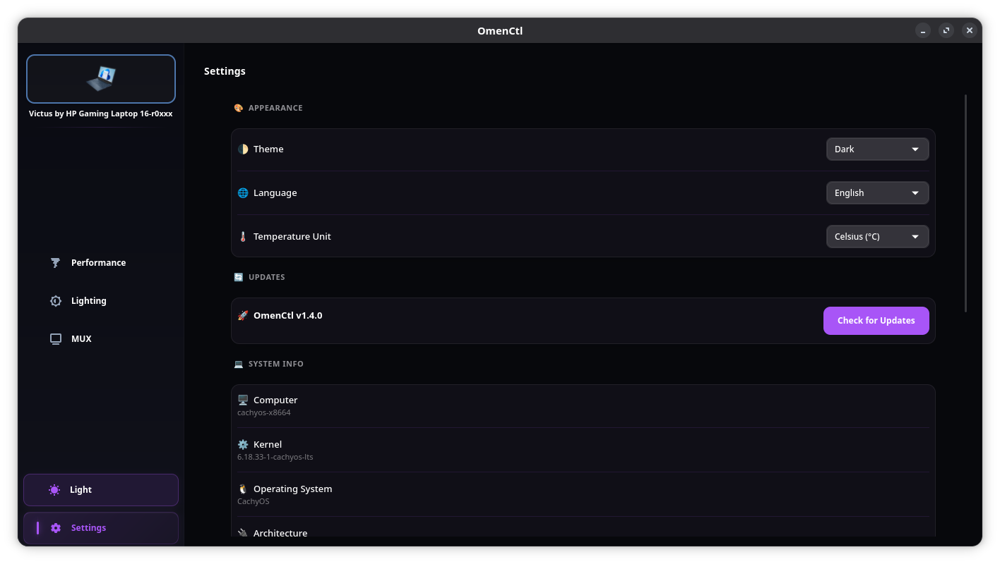

# OmenCtl v1.6.0-preview
<p align="center">
  
</p>

<p align="center">
  <b>Native, lightweight, and ultra-high-fidelity Linux control center for HP Omen & Victus laptops.</b><br>
  An elegant, open-source replacement for the official OMEN Gaming Hub designed for peak performance, extreme customizability, and absolute stability.
</p>

---

## 📖 UI Overview (Dark & Light Themes)

<p align="center">
  
  
  
  
  
  
</p>

---

## 🌟 Welcome to OmenCtl
**OmenCtl** bridges the gap between official Windows gaming tools and Linux. Combining low-level ACPI/WMI registers with beautiful GTK4 designs, OmenCtl gives you full control over your laptop's performance, cooling, and aesthetics.

> **OmenCore Inspiration:** Our advanced WMI handling and robust underlying architecture draw powerful inspiration from the phenomenal Windows project **[OmenCore](https://github.com/theantipopau/omencore)** by theantipopau. We are proud to bring that level of deep hardware access and feature parity to the Linux ecosystem!

---

## 🚀 Key Features

* **⚡ Advanced Power Tuning & Undervolting:** Directly toggle hardware power profiles (`power-saver`, `balanced`, `performance`). Full support for custom CPU undervolting, TCC offsets, and PL1/PL2 power limits. Features a conditional UI that automatically adapts to your motherboard's specific capabilities.
* **🌪️ Stable & Silent Fans:** Employs a 15-sample moving average and 4°C deadband. Fans react instantly to thermal spikes but stay calm and silent during minor temperature fluctuations. Includes a custom curve spline editor and dual-telemetry governing (`max(cpu_temp, gpu_temp)`).
* **🎮 GPU MUX Switch:** Seamless graphics mode switching between **Hybrid (Optimus)**, **Discrete (Dedicated GPU)**, and **Integrated (iGPU)** using `envycontrol`, `supergfxctl`, or `prime-select` backends.
* **🌈 Zero-Overhead RGB Lighting:** 4-Zone keyboard control with static, breathing, wave, and cycle animation effects. The animation engine uses exactly **0% CPU** in static states.
* **🕹️ Unified App & Game Profiles:** Automatically detects games running via Steam, Flatpak, Snap, Lutris, and Heroic Games Launcher to engage custom power and fan profiles dynamically.

---

## 💾 Installation & Upgrades

### Prerequisites
* A compatible Linux distribution (Ubuntu, Fedora, Arch, OpenSUSE, CachyOS, etc.)
* `git` installed

### Fresh Installation / Upgrading to v1.6.0-preview
Open your terminal and run:
```bash
# Clone or pull the repository
git clone https://github.com/yunusemreyl/OmenCtl.git
cd OmenCtl
git pull

# Run the unified installer (requires root)
chmod +x setup.sh
sudo ./setup.sh install
```
*(To perform an upgrade without losing configuration, run `sudo ./setup.sh update`)*

### Uninstallation
To completely remove OmenCtl and all its services:
```bash
cd OmenCtl
sudo ./setup.sh uninstall
```

---

## 💻 Hardware & OS Support

* **Supported Product Families:** HP OMEN 15, 16, 17 | HP OMEN Transcend 14 & 16 | HP Victus 15 & 16
* **OS Compatibility:** 
  * ✅ **Ubuntu 24.04 LTS / Zorin OS / Pop!_OS / Linux Mint** (`apt`)
  * ✅ **Fedora 42+ / Nobara** (`dnf`)
  * ✅ **Arch Linux / CachyOS / Manjaro** (`pacman`)
  * ✅ **OpenSUSE Tumbleweed** (`zypper`)

---

## 👨‍💻 Credits & Contributors

### 👑 Core Maintainer & Lead Developers
* **[yunusemreyl](https://github.com/yunusemreyl)** - Lead Developer & Maintainer
* **[tuxov](https://github.com/tuxov)** - Kernel Module & Patch Lead (Maintainer of `hp-wmi-fan-and-backlight-control`)

### 🌟 Project Inspiration & Special Acknowledgements
* **[theantipopau/omencore](https://github.com/theantipopau/omencore)** - A special thank you to **theantipopau** for the Windows **OmenCore** software library. OmenCore's clean abstraction of ACPI/WMI methods served as a magnificent reference and inspiring foundation for achieving robust feature parity on Linux!

### 🛠️ Pull Request Contributors
| PR Contributor | Contribution |
| :--- | :--- |
| **[@CodesRahul96](https://github.com/CodesRahul96)** | Contributed Application Profiles, Victus fixes, and Hindi localization |
| **[@xcellsior](https://github.com/xcellsior)** | Nvidia Dynamic Boost 80W cap mitigation patch |
| **[@TitoTFP](https://github.com/TitoTFP)** | Custom fan PWM fallback support (`#66`) |
| **[@SafSaf0999](https://github.com/SafSaf0999)** | EC register 0x11 fan speed fallback on OMEN 17-cb1xxx (`#31`) |
| **[@yijean34-source](https://github.com/yijean34-source)** | Test script and troubleshooting documentation (`#74`) |

### 💖 Heartfelt Community Appreciation
A massive thank you to all our amazing community members who have opened issues, reported bugs, suggested features, and tested beta updates. Your efforts make **OmenCtl** stable, reliable, and premium!

| Contributor | Contributor | Contributor | Contributor |
| :--- | :--- | :--- | :--- |
| **[@reekta92](https://github.com/reekta92)** | **[@brnlsn](https://github.com/brnlsn)** | **[@arjunshinoj](https://github.com/arjunshinoj)** | **[@TitoTFP](https://github.com/TitoTFP)** |
| **[@dkdue](https://github.com/dkdue)** | **[@siriiuss](https://github.com/siriiuss)** | **[@KursatGirgin](https://github.com/KursatGirgin)** | **[@zeustron](https://github.com/zeustron)** |
| **[@estrov-s](https://github.com/estrov-s)** | **[@Aegdwyn](https://github.com/Aegdwyn)** | **[@desekilibrio](https://github.com/desekilibrio)** | **[@seeleseelebronya](https://github.com/seeleseelebronya)** |
| **[@22364yiqun](https://github.com/22364yiqun)** | **[@NullGuardian](https://github.com/NullGuardian)** | **[@zjkhy94](https://github.com/zjkhy94)** | **[@jellotheman](https://github.com/jellotheman)** |
| **[@cptodix](https://github.com/cptodix)** | **[@ferant2406](https://github.com/ferant2406)** | **[@waheeb4](https://github.com/waheeb4)** | **[@YKangul](https://github.com/YKangul)** |
| **[@connor2623](https://github.com/connor2623)** | **[@Entharia](https://github.com/Entharia)** | **[@dfshsu](https://github.com/dfshsu)** | **[@babyinlinux](https://github.com/babyinlinux)** |
| **[@Hakan4178](https://github.com/Hakan4178)** | **[@m24ih](https://github.com/m24ih)** | **[@KuroSeinenbutV2](https://github.com/KuroSeinenbutV2)** | **[@ireneuszi83](https://github.com/ireneuszi83)** |
| **[@TokynBlast](https://github.com/TokynBlast)** | **[@DanielAugustJanson](https://github.com/DanielAugustJanson)** | **[@Ja4e](https://github.com/Ja4e)** | **[@EttoreCSenatore](https://github.com/EttoreCSenatore)** |
| **[@MasonDye](https://github.com/MasonDye)** | **[@mwbzde](https://github.com/mwbzde)** | **[@BlazingDeck](https://github.com/BlazingDeck)** |  |

*And to every developer, tester, and supporter in the open-source community!*

---

## ⚖️ Legal Disclaimer
OmenCtl is an independent open-source project developed by **yunusemreyl** and is **NOT** officially affiliated with, authorized, or endorsed by **Hewlett-Packard (HP)**. All product names, logos, and brands are property of their respective owners.

*Developed with ❤️ by yunusemreyl & Contributors*
