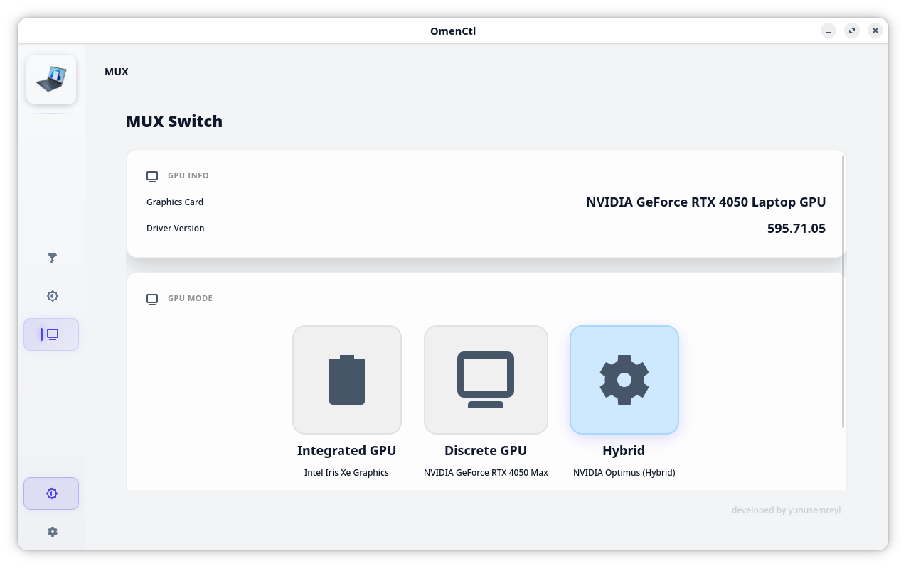
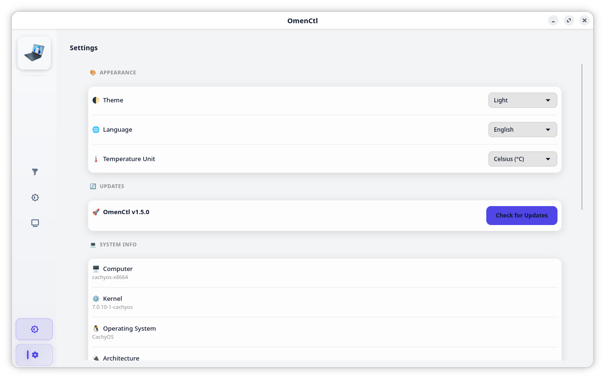

## OmenControl v1.5.0 ##
<p align="center">
  
</p>

<p align="center">
  <b>⚡ More Modern. More Responsive. Simply Better.</b><br><br>
  <b>Native, lightweight, and ultra-high-fidelity Linux control center for HP Omen & Victus series laptops.</b><br>
  An elegant, open-source replacement for the official OMEN Gaming Hub designed for peak performance, extreme customizability, and absolute stability.
</p>

---

## 📖 Presentation

### 🌓 Sleek Theme-Adaptive UI (Dark & Light Modes)

<p align="center">
  <b>📊 Performance Dashboard</b>
</p>
<p align="center">
  
  
</p>

<p align="center">
  <b>🌈 Keyboard RGB Lighting</b>
</p>
<p align="center">
  
  
</p>

<p align="center">
  <b>🎮 MUX GPU Switch</b>
</p>
<p align="center">
  
  
</p>

<p align="center">
  <b>⚙️ Settings & Custom Themes</b>
</p>
<p align="center">
  
  
</p>

---

> [!NOTE]
> ### 🌟 Welcome to OmenCtl (v1.5.0 Release)
> **OmenCtl** (formerly *OMEN Command Center for Linux*) is a completely re-engineered, native control suite built to bridge the gap between official Windows tools and Linux. By combining low-level ACPI/WMI registers with beautiful, modern GTK4 interface designs, OmenCtl gives you full dominion over your laptop.
> 
> **Here is what OmenCtl accomplishes for your laptop:**
> * **🌪️ Silent & Stable Fans:** Re-engineered with a 15-sample moving average and 4°C deadband. Fans react instantly to thermal spikes but stay calm and silent during minor temperature fluctuations. No more constant fan pulsing/revving!
> * **⚡ Zero-Delay Power Profiles:** Instantly toggle direct hardware power profiles (Saver, Balanced, Performance) without any PolicyKit authentication popups or D-Bus lockups.
> * **🌈 Zero-overhead Keyboard RGB:** Full hex color zoning and lighting effects utilizing a specialized animation engine that consumes exactly **0% CPU** on static states.
> * **🎮 Seamless GPU MUX Controls:** Easily switch between Hybrid, Discrete, and Integrated graphics modes with envycontrol, supergfxctl, or prime-select backends.
> * **📊 Beautiful Telemetry:** Gorgeous radial dials and mechanical meters showing real-time CPU/GPU loads, disk usage, and temperature details.

---

## 🚀 Key Features

### 🌪️ Stable & Silent Fan Control
* **High-Fidelity Instruments:** Gorgeous mechanical radial speedometer gauges showing real-time CPU/GPU loads, frequencies, fan RPMs, battery status, and disk utilization.
* **Stable Hysteresis Algorithm:** Re-engineered fan controller with a **15-sample moving average history** and a **4.0°C cooling hysteresis deadband**. The fans react instantly to cool your system but remain locked at speed during slight CPU temperature drops, preventing annoying fan speed pulsing/triggering sounds.
* **RPM Jitter Filter:** Filters out small speed adjustments under a 400 RPM threshold for quiet, stable acoustics.
* **Custom Curve Editor:** Precise drag-and-drop spline editor letting you design custom temperature-to-speed curves with interactive grid snap.

### ⚡ WMI Hardware-First Power Profiles
* **Dynamic hp-wmi Capsule:** The power profiles segment automatically queries your WMI bus and builds buttons matching the exact parameters supported by your laptop (e.g. `power-saver`, `balanced`, `performance`). No hardcoded or mismatched buttons.
* **Hardware-First Sync:** Queries the direct ACPI/WMI hardware registers (`/sys/firmware/acpi/platform_profile`) as the primary source of truth, guaranteeing instant, uncached profile synchronization.
* **PPD Polkit-Free Transitions:** Integrated the `powerprofilesctl` tool natively under our root microservice, bypassing complex D-Bus and PolicyKit `AccessDenied` write locks.
* **cTGP & PPAB Boost paths:** Automatically locks CPU and GPU boost rails (Configurable TGP & PPAB) at the hardware level when performance mode is engaged.

### 🎨 Premium Dynamic Themes
* **Theme-Adaptive Visuals:** High-contrast Dark and Light modes. Gauges, radial rings, and capsule buttons dynamically invert their colors, tracks, and borders to offer premium visual excellence.
* **Performance-Reactive Accents:** The global theme accent color reacts dynamically to your active performance profile (glowing emerald for Power Saver, HP red for Balanced, and electric purple for Performance).

### 🌈 RGB Lighting Customization
* **4-Zone Keyboard Control:** Full hex color customization per zone.
* **Dazzling Animation Modes:** Static, Breathing, Wave, and Cycle effects.
* **Zero-CPU Animation Engine:** Parked animations thread locks at exactly **0% CPU** for static colors and uses precise signal polling for active animations to keep your laptop serenely cool.

### 🎮 GPU MUX Switch
* Seamless graphics mode switching between **Hybrid (Optimus)**, **Discrete (Dedicated GPU)**, and **Integrated (Intel/AMD iGPU)**.
* Built-in backends supporting `envycontrol`, `supergfxctl`, and `prime-select`.

---

## 💾 Installation & Upgrades

### Prerequisites
* A compatible Linux distribution (Ubuntu, Fedora, Arch, OpenSUSE, CachyOS, etc.)
* `git` installed.

---
> [!NOTE]
>### Upgrading to v1.5.0
>To upgrade your current installation, clean up legacy remnants, and load the new optimized permissions:
>```bash
>git clone https://github.com/yunusemreyl/OmenCtl.git
>cd OmenCtl
>git pull
>sudo ./setup.sh update
>```
>*(The update routine will sturdily stashen your files, pull the latest repo, remove all legacy `omencommandcenterforlinux` leftover links, reload systemd, and cleanly restart the microservices).*
---
### Fresh Install
Open your terminal and run:
```bash
# Clone the repository
git clone https://github.com/yunusemreyl/OmenCtl.git
cd OmenCtl

# Run the unified installer (requires root)
chmod +x setup.sh
sudo ./setup.sh install
```

### Uninstallation
To completely remove OmenCtl and all its services:
```bash
cd OmenCtl
sudo ./setup.sh uninstall
```

---

## 🐧 OS Compatibility

| Distribution | Status | Notes |
|--------------|--------|-------|
| **Ubuntu 24.04 LTS / Zorin OS / Pop!_OS / Linux Mint** | ✅ Verified | Full support via `apt` |
| **Fedora 42+ / Nobara** | ✅ Verified | Full support via `dnf` |
| **Arch Linux / CachyOS / Manjaro** | ✅ Verified | Full support via `pacman` |
| **OpenSUSE Tumbleweed** | ✅ Verified | Full support via `zypper` |

---

## 👨‍💻 Credits & Contributors

### 👑 Core Maintainer & Lead Developers
* **[yunusemreyl](https://github.com/yunusemreyl)** - Lead Developer & Maintainer
* **[tuxov](https://github.com/tuxov)** - Kernel Module & Patch Lead (Maintainer of the exceptional `hp-wmi-fan-and-backlight-control` kernel driver)

### 🛠️ Pull Request Contributors
A special thank you to our contributors who have directly submitted code patches and pull requests to improve the codebase:

| PR Contributor | Contribution |
| :--- | :--- |
| **[@xcellsior](https://github.com/xcellsior)** | Nvidia Dynamic Boost 80W cap mitigation patch |
| **[@TitoTFP](https://github.com/TitoTFP)** | Custom fan PWM fallback support (`#66`) |
| **[@SafSaf0999](https://github.com/SafSaf0999)** | EC register 0x11 fan speed fallback on OMEN 17-cb1xxx (`#31`) |
| **[@yijean34-source](https://github.com/yijean34-source)** | Test script and troubleshooting documentation (`#74`) |

### 💖 Heartfelt Community Appreciation
A massive, glowing thank you to all our amazing community members who have opened issues, reported bugs, suggested features, and tested beta updates. Your efforts make **OmenCtl** stable, reliable, and premium!

| Contributor | Contributor | Contributor | Contributor |
| :--- | :--- | :--- | :--- |
| **[@reekta92](https://github.com/reekta92)** | **[@brnlsn](https://github.com/brnlsn)** | **[@arjunshinoj](https://github.com/arjunshinoj)** | **[@TitoTFP](https://github.com/TitoTFP)** |
| **[@dkdue](https://github.com/dkdue)** | **[@siriiuss](https://github.com/siriiuss)** | **[@KursatGirgin](https://github.com/KursatGirgin)** | **[@zeustron](https://github.com/zeustron)** |
| **[@estrov-s](https://github.com/estrov-s)** | **[@Aegdwyn](https://github.com/Aegdwyn)** | **[@desekilibrio](https://github.com/desekilibrio)** | **[@seeleseelebronya](https://github.com/seeleseelebronya)** |
| **[@22364yiqun](https://github.com/22364yiqun)** | **[@NullGuardian](https://github.com/NullGuardian)** | **[@zjkhy94](https://github.com/zjkhy94)** | **[@jellotheman](https://github.com/jellotheman)** |
| **[@cptodix](https://github.com/cptodix)** | **[@ferant2406](https://github.com/ferant2406)** | **[@waheeb4](https://github.com/waheeb4)** | **[@YKangul](https://github.com/YKangul)** |
| **[@connor2623](https://github.com/connor2623)** | **[@Entharia](https://github.com/Entharia)** | **[@dfshsu](https://github.com/dfshsu)** | **[@babyinlinux](https://github.com/babyinlinux)** |
| **[@Hakan4178](https://github.com/Hakan4178)** | **[@m24ih](https://github.com/m24ih)** | **[@KuroSeinenbutV2](https://github.com/KuroSeinenbutV2)** | **[@ireneuszi83](https://github.com/ireneuszi83)** |
| **[@TokynBlast](https://github.com/TokynBlast)** | **[@DanielAugustJanson](https://github.com/DanielAugustJanson)** | **[@Ja4e](https://github.com/Ja4e)** | |

*And to every developer, tester, and supporter in the open-source community!*

---

## ⚖️ Legal Disclaimer
OmenCtl is an independent open-source project developed by **yunusemreyl** and is **NOT** officially affiliated with, authorized, or endorsed by **Hewlett-Packard (HP)**. All product names, logos, and brands are property of their respective owners.

*Developed with ❤️ by yunusemreyl & Contributors*
