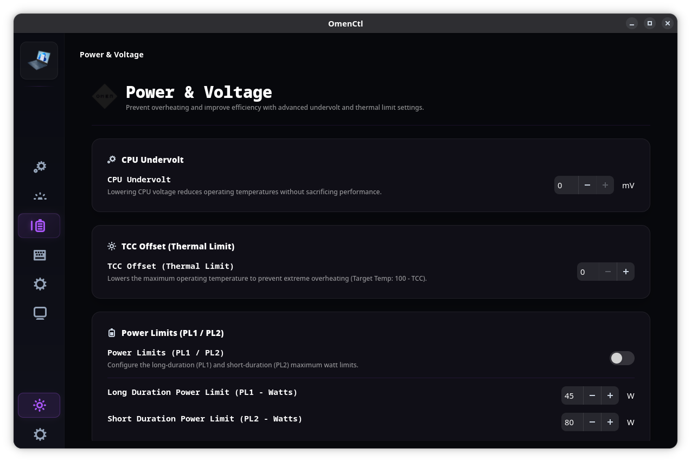
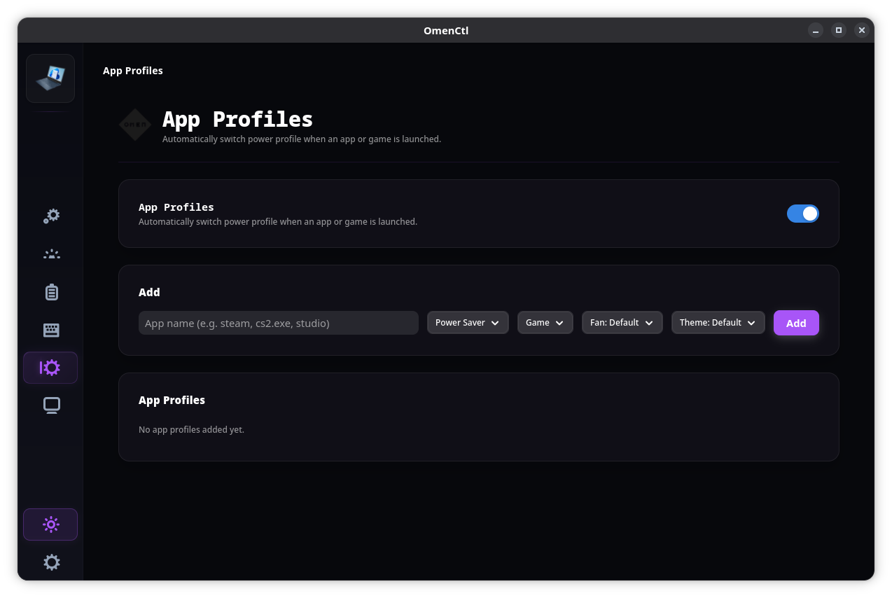
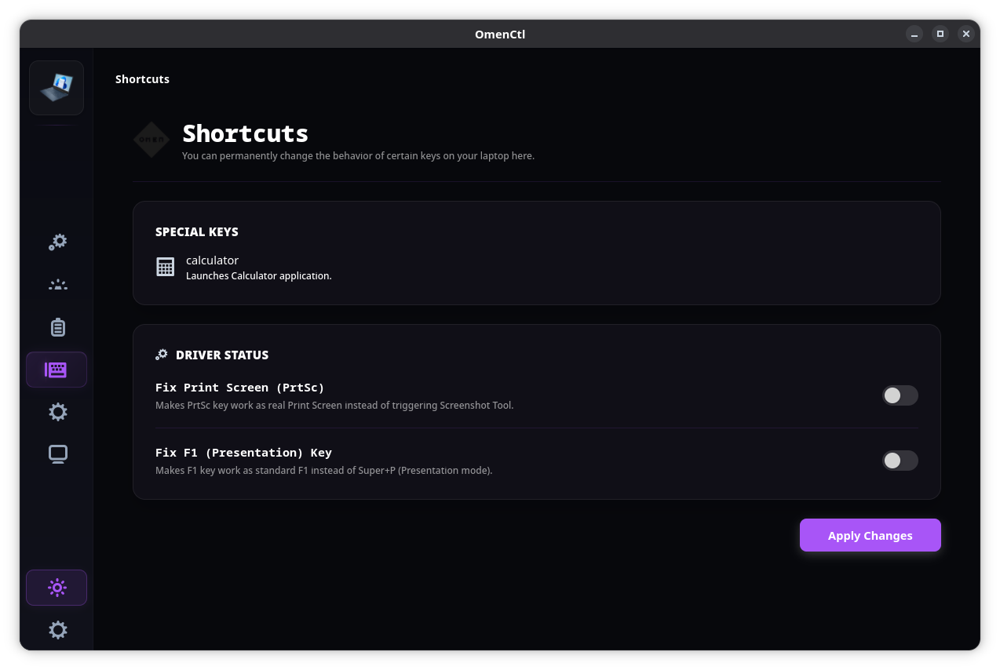

# OmenCtl v1.6.4
<p align="center">
  
</p>

<p align="center">
  <b>Advanced Linux control center for HP Omen & Victus laptops.</b><br>
  An open-source tool for managing performance profiles, custom fan curves, RGB lighting, and hardware power limits.
</p>

---

## 📖 UI Overview

### Performance & Fan Control

<p><em>Toggle hardware power profiles (<code>power-saver</code>, <code>balanced</code>, <code>performance</code>). Manage thermal profiles, view real-time hardware telemetry, and create custom fan curve splines with a 15-sample moving average deadband for silent operation.</em></p>

### Power Tuning [Now in Alpha]

<p><em>Fine-tune your hardware limits directly. Apply custom CPU Undervolt offsets, configure TCC (Thermal Velocity Boost) targets, and set precise PL1/PL2 wattage limits. (Note: This page is automatically hidden on devices that do not support hardware power tuning, such as non-HX Victus models).</em></p>

### Application Profiles

<p><em>Automatically detect running games across Steam, Flatpak, Lutris, and Heroic Games Launcher to dynamically switch to custom power and fan presets.</em></p>

### RGB Lighting

<p><em>Customize 4-Zone keyboard backlighting with static colors, breathing, wave, and cycle animation effects driven by a zero-overhead animation engine.</em></p>

### MUX Switch & Graphics [WMI control now in Alpha]

<p><em>Seamlessly toggle your graphics mode between Hybrid (Optimus), Discrete, and Integrated using supported backends like envycontrol, supergfxctl, or prime-select.</em></p>

### Shortcuts & Macros

<p><em>Map dedicated Omen keys and custom macros to perform quick actions or execute custom shell scripts on the fly.</em></p>

### Settings & Hardware Dumps

<p><em>Configure background service behavior and generate low-level DSDT / WMI hardware dumps for troubleshooting. Features automated EC (Embedded Controller) fallbacks for boards with broken ACPI WMI queries (e.g., HP Victus 8E35, OMEN 17-cb1xxx).</em></p>

---

## 💾 Installation & Upgrades

### Prerequisites
* A compatible Linux distribution (Ubuntu, Fedora, Arch, OpenSUSE, CachyOS, etc.)
* `git` installed

### Installation (v1.6.4)
Open your terminal and run:
```bash
# Clone the repository
git clone https://github.com/yunusemreyl/OmenCtl.git
cd OmenCtl

# Run the unified installer
chmod +x setup.sh
sudo ./setup.sh install
```
*(To upgrade an existing installation without losing configuration, run `sudo ./setup.sh update`)*

### NixOS Installation (Flake)
OmenCtl comes with built-in Nix Flake support and a dedicated NixOS module.

1. Add OmenCtl to your `flake.nix` inputs:
```nix
inputs = {
  nixpkgs.url = "github:nixos/nixpkgs/nixos-unstable";
  omenctl.url = "github:yunusemreyl/OmenCtl";
  omenctl.inputs.nixpkgs.follows = "nixpkgs";
};
```
2. Import the module in your `nixosConfigurations`:
```nix
outputs = { self, nixpkgs, omenctl, ... }: {
  nixosConfigurations.my-laptop = nixpkgs.lib.nixosSystem {
    system = "x86_64-linux";
    modules = [
      ./configuration.nix
      omenctl.nixosModules.default
    ];
  };
};
```
3. Enable OmenCtl in your `configuration.nix`:
```nix
programs.omenctl = {
  enable = true;
  loadCustomDriver = true; # Loads the custom hp-wmi and hp-rgb-lighting kernel modules
};
```

### Uninstallation
```bash
cd OmenCtl
sudo ./setup.sh uninstall
```

---

## 💻 Hardware & OS Support

* **Supported Product Families:** HP OMEN 15, 16, 17 | HP OMEN Transcend 14 & 16 | HP Victus 15 & 16
* **OS Compatibility:** 
  * ✅ **Ubuntu 24.04 LTS / Zorin OS / Pop!_OS / Linux Mint** (`apt`)
  * ✅ **Fedora 42+ / Nobara** (`dnf`)
  * ✅ **Arch Linux / CachyOS / Manjaro** (`pacman`)
  * ✅ **OpenSUSE Tumbleweed** (`zypper`)

---

## 👨‍💻 Credits & Contributors

### Maintainers
* **[yunusemreyl](https://github.com/yunusemreyl)** - Lead Developer
* **[tuxov](https://github.com/tuxov)** - Kernel Module Lead

### Pull Request Contributors
| PR Contributor | Contribution |
| :--- | :--- |
| **[@CodesRahul96](https://github.com/CodesRahul96)** | Contributed Application Profiles, Victus fixes, and Hindi localization |
| **[@xcellsior](https://github.com/xcellsior)** | Nvidia Dynamic Boost 80W cap mitigation patch |
| **[@TitoTFP](https://github.com/TitoTFP)** | Custom fan PWM fallback support (`#66`) |
| **[@SafSaf0999](https://github.com/SafSaf0999)** | EC register 0x11 fan speed fallback on OMEN 17-cb1xxx (`#31`) |
| **[@yijean34-source](https://github.com/yijean34-source)** | Test script and troubleshooting documentation (`#74`) |

### Community Contributors
| Contributor | Contributor | Contributor | Contributor |
| :--- | :--- | :--- | :--- |
| **[@reekta92](https://github.com/reekta92)** | **[@brnlsn](https://github.com/brnlsn)** | **[@arjunshinoj](https://github.com/arjunshinoj)** | **[@TitoTFP](https://github.com/TitoTFP)** |
| **[@dkdue](https://github.com/dkdue)** | **[@siriiuss](https://github.com/siriiuss)** | **[@KursatGirgin](https://github.com/KursatGirgin)** | **[@zeustron](https://github.com/zeustron)** |
| **[@estrov-s](https://github.com/estrov-s)** | **[@Aegdwyn](https://github.com/Aegdwyn)** | **[@desekilibrio](https://github.com/desekilibrio)** | **[@seeleseelebronya](https://github.com/seeleseelebronya)** |
| **[@22364yiqun](https://github.com/22364yiqun)** | **[@NullGuardian](https://github.com/NullGuardian)** | **[@zjkhy94](https://github.com/zjkhy94)** | **[@jellotheman](https://github.com/jellotheman)** |
| **[@cptodix](https://github.com/cptodix)** | **[@ferant2406](https://github.com/ferant2406)** | **[@waheeb4](https://github.com/waheeb4)** | **[@YKangul](https://github.com/YKangul)** |
| **[@connor2623](https://github.com/connor2623)** | **[@Entharia](https://github.com/Entharia)** | **[@dfshsu](https://github.com/dfshsu)** | **[@babyinlinux](https://github.com/babyinlinux)** |
| **[@Hakan4178](https://github.com/Hakan4178)** | **[@m24ih](https://github.com/m24ih)** | **[@KuroSeinenbutV2](https://github.com/KuroSeinenbutV2)** | **[@ireneuszi83](https://github.com/ireneuszi83)** |
| **[@TokynBlast](https://github.com/TokynBlast)** | **[@DanielAugustJanson](https://github.com/DanielAugustJanson)** | **[@Ja4e](https://github.com/Ja4e)** | **[@EttoreCSenatore](https://github.com/EttoreCSenatore)** |
| **[@MasonDye](https://github.com/MasonDye)** | **[@mwbzde](https://github.com/mwbzde)** | **[@BlazingDeck](https://github.com/BlazingDeck)** | **[@longancut41](https://github.com/longancut41)** |
| **[@moong8te](https://github.com/moong8te)** | **[@Anchxt11](https://github.com/Anchxt11)** | **[@NorthSimon](https://github.com/NorthSimon)** | **[@WertC-14](https://github.com/WertC-14)** |
| **[@FreebeamX2](https://github.com/FreebeamX2)** | **[@aacruz018-wq](https://github.com/aacruz018-wq)** | **[@ViolinKaine](https://github.com/ViolinKaine)** | **[@FDY58](https://github.com/FDY58)** |
| **[@fkDeath](https://github.com/fkDeath)** | **[@Prajwaldark](https://github.com/Prajwaldark)** | **[@sudipta9](https://github.com/sudipta9)** | **[@AtlasCoded2026](https://github.com/AtlasCoded2026)** |

---

## 📄 License
This project is licensed under the **GNU General Public License v3.0** (GPL-3.0). See the [LICENSE](LICENSE) file for details.

## ⚖️ Legal Disclaimer
OmenCtl is an independent open-source project and is **NOT** officially affiliated with, authorized, or endorsed by **Hewlett-Packard (HP)**.
